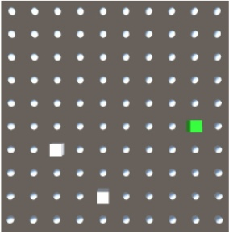
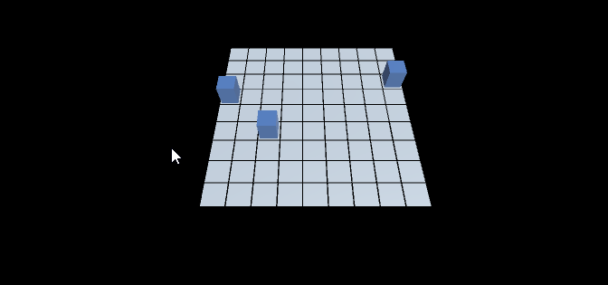
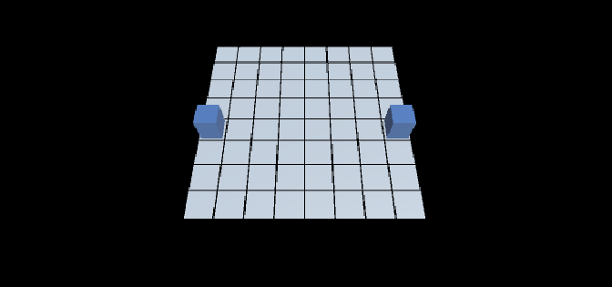
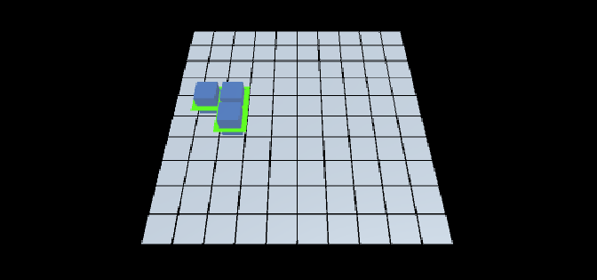
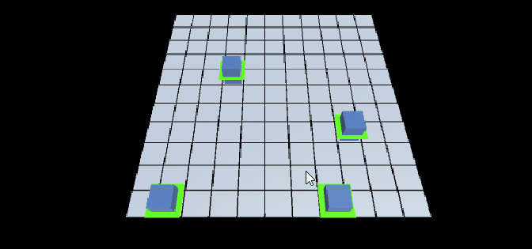
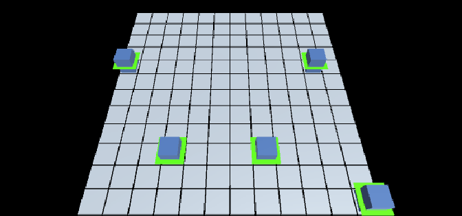

# Тестовое задание Nival

## Задание
#### Цель
Создать прототип клиент-серверной стратегической игры.
#### Средства
Клиент должен быть написан на Unity (желательно не выше версии 5.6.0)
Сервер - приложение на C#
#### Общее описание задачи
Есть поле (сетка n на n, где 7<=n<=12) и несколько юнитов (до 5). На картинке
изображен пример поля 10 на 10 с тремя юнитами. Зелёный юнит - юнит который
сейчас выделен.

  

При старте клиент подключается к серверу и запрашивает у него случайно
сгенерированную информацию о мире - размер поля, количество юнитов и их
начальную позицию в узлах сетки. На основе этой информации клиент создает у себя
визуальное представление этого мира.
Юнитов на клиенте можно выделять по левому клику мыши, либо рамкой, как в
стратегических играх. Выделенным юнитам можно отдавать команду двигаться в
указанный узел сетки по правой кнопке мыши.

#### Требования
- Юниты могут двигаться только по вертикали или горизонтали - из одного узла
сетки в другой.
- При движении юниты не должны пересекаться между собой и занимать одну и
ту же позицию на сетке.
- Если точка куда должен прийти юнит занята, то он останавливается на
ближайшей к ней, до которой смог дойти.
- Вся логика движения юнитов, избегания столкновений и поиск пути происходит
на сервере. Клиент только отображает юниты в их текущей позиции,
получаемой с сервера. Помимо выделения юнитов и отдачи им команд другой
логики на клиенте быть не должно.
- У юнита на клиенте должно быть два состояния - идёт и стоит, а также
простейшее переключение анимации при смене состояния (юнит проигрывает
одну анимацию при ходьбе и другую - стоя на месте)

## Реализация
Сервер - UnityServer.
Сервер сделан на WebAPI. Для работы сервера, нужно запустить проект в Visual Studio и запустить UnityServer.

Код логики на сервере находится в папке UnityServer/GameLogic.
Обработка POST и GET запросов происходит в UnityServer/Controllers/ValuesController.cs

Клиент обращается к серверу по "http://localhost:60006”.

#### Пример выбора юнитов

    

#### Пример перемещения для различного количества юнитов

  
  
  
  

